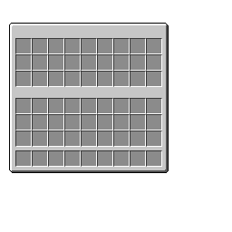

# Custom GUIs

To create a custom GUI, you need two things; the texture and a plugin for the GUI.

### Creating the GUI texture

Okay, so firstly, we need to create the texture and add it as a glyph to Oraxen. One thing you need to make sure you have done is position the GUI correctly in the .png file that will have the custom gui. I have supplied templates for 1 - 6 line GUIs so that you do not have to struggle.




Coming soon




Coming soon








Coming soon



Coming soon



Coming soon



In this tutorial however I am going to be using a 3 row GUI which is equivalent to a single chest. Now that you have chosen the GUI size, it is time to make the actual texture.&#x20;

There is a selection of different software I would recommend for texturing, and they are the following:

* Aseprite (Paid)
*
