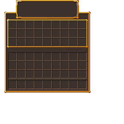

# Custom GUIs

To create a custom GUI, you need two things; the texture and a plugin for the GUI.

### Creating the GUI texture

Okay, so firstly, we need to create the texture and add it as a glyph to Oraxen. One thing you need to make sure you have done is position the GUI correctly in the .png file that will have the custom gui. I have supplied templates for 1 - 6 line GUIs so that you do not have to struggle.





Coming soon





Coming soon









Coming soon



Coming soon



Coming soon



In this tutorial however I am going to be using a 3 row GUI which is equivalent to a single chest. Now that you have chosen the GUI size, it is time to make the actual texture.&#x20;

There is a selection of different software I would recommend for texturing, and they are the following:

* Aseprite (Paid)
* paint.net (Free)

Now you need to open the software and edit the GUI template you selected to match your needs for your server, here is what I have created:



### Adding the glyph

Now that you have your finished texture, you need to add the texture to the game. What I recommend you do is create a new .yml file in the glyphs section of the oraxen folder, as it is more organised then glyphs being in one file that is clunky and hard to locate what you may be looking for if you want to make any changes.

Now add the texture to your chosen location in `/pack/textures` and keep note of it's location for later.

We can now go back to the .yml file we created earlier and paste in the following, changing the location for the location of where you added your texture and changing the name of the glyph to something that represents your GUI and is original.

```yaml
gui: # please change 'gui' to something that represents your gui
  texture: gui/mygui # this is inside pack/textures/
  ascent: 37
  height: 256
```

We have now added the glyph to the game, so all we need to do is create the gui, and for this we need a plugin.

### Creating the GUI in-game

Firstly, you will need a GUI plugin, here is a list of the most popular ones used with oraxen:

* DeluxeMenus
*
